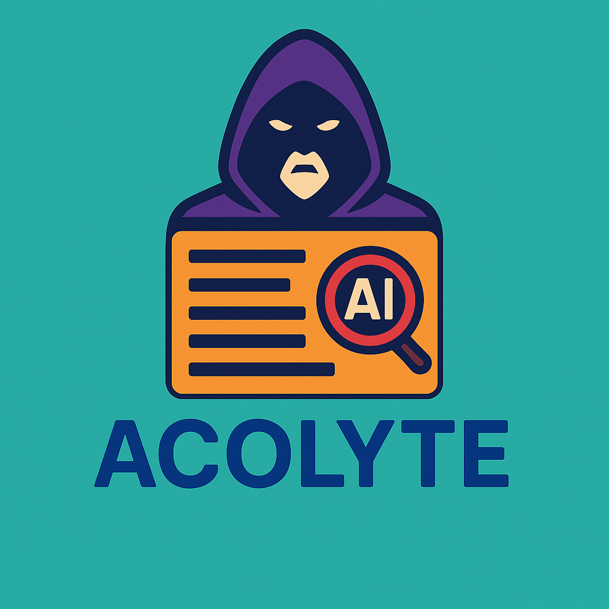

<p align="center">
  
</p>

# Acolyte

[](https://www.python.org/downloads/)
[](https://fastapi.tiangolo.com/)
[](https://www.sqlalchemy.org/)
[](https://opensource.org/licenses/MIT)
[](https://www.anthropic.com/)
[](https://openai.com/)
[](https://ai.google.dev/)
[](https://github.com/astral-sh/uv)
[]()

*[English](README.md) | [中文](README_zh.md)*

Acolyte是一个内容分析评估系统，专注于检测文本内容中的偏见、误导性和隐藏意图。系统支持通过Web界面、CLI和API三种方式提交内容，由单个或多个LLM进行分析评估。

## 主要特性

- **多种访问方式**：Web界面、CLI和API
- **灵活的LLM集成**：支持多种LLM供应商（Anthropic Claude、OpenAI、Google Gemini）
- **高级分析工作流**：
  - 单LLM处理流程
  - 多LLM并行处理流程
  - 多LLM评议汇总流程，包含投票机制
- **全面的内容分析**：
  - 偏见检测
  - 误导性内容检测
  - 隐藏意图检测
  - 多指标量化评分系统
- **统一日志系统**：
  - 可配置的日志级别
  - 多种输出目的地（控制台、文件）
  - 详细的诊断信息
- **历史记录与管理**：
  - 任务记录存储与检索
  - 结果可视化
- **现代化Web界面**：
  - 基于Tailwind CSS和shadcn UI的响应式设计
  - 内容分析提交表单
  - LLM配置管理
  - 任务历史和结果可视化
  - 提示词模板管理

## 安装

使用[uv](https://github.com/astral-sh/uv)（推荐的包管理器）创建虚拟环境并安装依赖：

```bash
# 创建虚拟环境
uv venv

# 安装依赖
uv pip install -r requirements.txt

# 以开发模式安装
uv pip install -e .
```

## 使用方法

### 启动API服务

```bash
# 基本启动
uv run -m acolyte.main

# 使用自定义日志级别启动
ACOLYTE_LOG_LEVEL=debug uv run -m acolyte.main

# 启用文件日志
ACOLYTE_LOG_TO_FILE=1 uv run -m acolyte.main

# 指定日志目录
ACOLYTE_LOG_DIR=/path/to/logs ACOLYTE_LOG_TO_FILE=1 uv run -m acolyte.main

# 指定自定义端口
ACOLYTE_PORT=8080 uv run -m acolyte.main
```

### 启动Web界面

```bash
# 进入web目录
cd acolyte/web

# 安装依赖
pnpm install

# 启动开发服务器
pnpm dev

# 启动开发服务器并绑定主机（可从其他设备访问）
pnpm dev --host

# 构建生产版本
pnpm build

# 运行测试
pnpm test

# 运行测试并生成覆盖率报告
pnpm test:coverage

# 检查代码格式
pnpm format:check

# 格式化代码
pnpm format

# 代码静态检查
pnpm lint
```

Web界面默认将在`http://localhost:5173`上可用。使用Web界面前请确保API服务已经启动。

### 使用CLI工具

```bash
# 分析内容
uv run -m acolyte.cli.main analyze content.txt --mode=single

# 使用配置文件中的特定LLM
uv run -m acolyte.cli.main analyze content.txt --llm-config "Claude-3"

# 使用多个LLM进行评议
uv run -m acolyte.cli.main analyze content.txt --mode=multiple_with_review --llm 1 --llm 2

# 查看历史记录
uv run -m acolyte.cli.main history list --limit=5

# 显示特定任务的结果
uv run -m acolyte.cli.main history show 123 --raw

# 显示multiple模式下特定LLM的结果
uv run -m acolyte.cli.main history show 123 --llm 2

# 以不同格式显示multiple模式下的所有结果
uv run -m acolyte.cli.main history show 123 --all --format summary
```

### 配置管理

```bash
# 添加LLM配置
uv run -m acolyte.cli.main config add-llm -n "Claude-3" -k "your-api-key" -u "https://api.anthropic.com/v1" -m "claude-3-opus-20240229"

# 导出LLM配置到文件
uv run -m acolyte.cli.main config export-config

# 从文件导入LLM配置
uv run -m acolyte.cli.main config import-config --name "Claude-3"

# 列出LLM配置
uv run -m acolyte.cli.main config list-llms

# 设置默认LLM
uv run -m acolyte.cli.main config set-default 1

# 列出提示词配置
uv run -m acolyte.cli.main config list-prompts

# 显示特定提示词内容
uv run -m acolyte.cli.main config show-prompt 1

# 同步提示词文件
uv run -m acolyte.cli.main config sync-prompts

# 删除LLM配置
uv run -m acolyte.cli.main config delete-llm 1

# 为CLI操作设置日志级别
ACOLYTE_LOG_LEVEL=debug uv run -m acolyte.cli.main analyze content.txt
```

## 配置

配置文件默认位于`~/.config/acolyte/config.json`，您可以通过环境变量`ACOLYTE_CONFIG_PATH`指定其他位置。

### 配置文件示例

```json
{
  "database_url": "sqlite:///acolyte.db",
  "default_prompt_version": "",
  "llm_configs": [
    {
      "name": "Claude-Sonnet",
      "api_key": "your-anthropic-api-key",
      "base_url": "https://api.anthropic.com/v1",
      "model_name": "claude-3-7-sonnet-latest",
      "description": "Anthropic Claude 3.7 Sonnet",
      "role": "normal",
      "is_default": true
    },
    {
      "name": "GPT-4o",
      "api_key": "your-openai-api-key",
      "base_url": "https://api.openai.com/v1",
      "model_name": "gpt-4o",
      "description": "OpenAI GPT-4o",
      "role": "normal",
      "is_default": false
    },
    {
      "name": "Gemini-Pro",
      "api_key": "your-google-api-key",
      "base_url": "https://generativelanguage.googleapis.com/v1beta",
      "model_name": "gemini-2.5-pro",
      "description": "Google Gemini 2.5 Pro",
      "role": "normal",
      "is_default": false
    },
    {
      "name": "Claude-Reviewer",
      "api_key": "your-anthropic-api-key",
      "base_url": "https://api.anthropic.com/v1",
      "model_name": "claude-3-7-sonnet-latest",
      "description": "Claude 3.7 Sonnet as reviewer",
      "role": "reviewer",
      "is_default": false
    }
  ]
}
```

## 开发注意事项

### 配置文件格式
配置文件必须使用以下格式：
```json
{
  "database_url": "sqlite:///acolyte.db",
  "default_prompt_version": "",
  "llm_configs": [...]
}
```

不要使用旧的嵌套格式`{"llms": {...}}`，这将导致配置无法正确加载。如果遇到此问题，可以使用`tools/convert_config.py`脚本转换格式。

### 数据库会话管理
使用SQLAlchemy时，确保不在会话外使用数据库对象，特别是在异步操作中。始终在会话上下文中获取和操作数据库对象。

### LLM API URL格式
不同的LLM供应商有不同的URL格式要求：
- Anthropic Claude: `https://api.anthropic.com/v1`
- OpenAI: `https://api.openai.com/v1`
- Google Gemini: `https://generativelanguage.googleapis.com/v1beta`

### 提示词模板
系统使用的偏见检测提示词位于`prompt/`目录，支持模型特定版本。添加新提示词后，需要运行`config sync-prompts`命令同步到数据库。命名格式为`bias-detection-prompt_vX.Y.md`或`bias-detection-prompt_vX.Y_modelname.md`。

### 工具脚本
项目在`tools/`目录下包含一些有用的工具脚本：
- `convert_config.py`: 转换配置文件格式
- `check_prompts.py`: 检查数据库中的prompt记录
- `direct_task_process.py`: 直接处理任务，绕过API
- `show_result.py`: 显示任务结果内容

### 启动顺序
1. 启动API服务器：`uv run -m acolyte.main`
2. 导入LLM配置：`uv run -m acolyte.cli.main config import-config`
3. 同步提示词：`uv run -m acolyte.cli.main config sync-prompts`
4. 开始使用系统分析内容

## 测试

Acolyte包含全面的测试套件，以确保代码质量和功能正常：

```bash
# 安装测试依赖
uv pip install pytest pytest-asyncio pytest-cov

# 运行所有测试
uv run pytest tests/unit/

# 运行特定测试模块
uv run pytest tests/unit/core/llm/test_response_parser.py
uv run pytest tests/unit/core/db/test_models.py
uv run pytest tests/unit/core/task/test_base_processor.py

# 运行带覆盖率报告的测试
uv run pytest tests/unit/ --cov=acolyte --cov-report=term --cov-report=html

# 运行特定测试函数
uv run pytest tests/unit/core/task/test_review_processor.py::TestReviewProcessor::test_save_votes -v
```

项目当前的测试覆盖率约为50%，其中LLM客户端实现等核心模块的覆盖率较高，CLI和服务层的覆盖率较低。未来的开发将专注于提高这些领域的测试覆盖率。

查看[tests/README.md](tests/README.md)获取有关测试框架和最佳实践的更多详细信息。